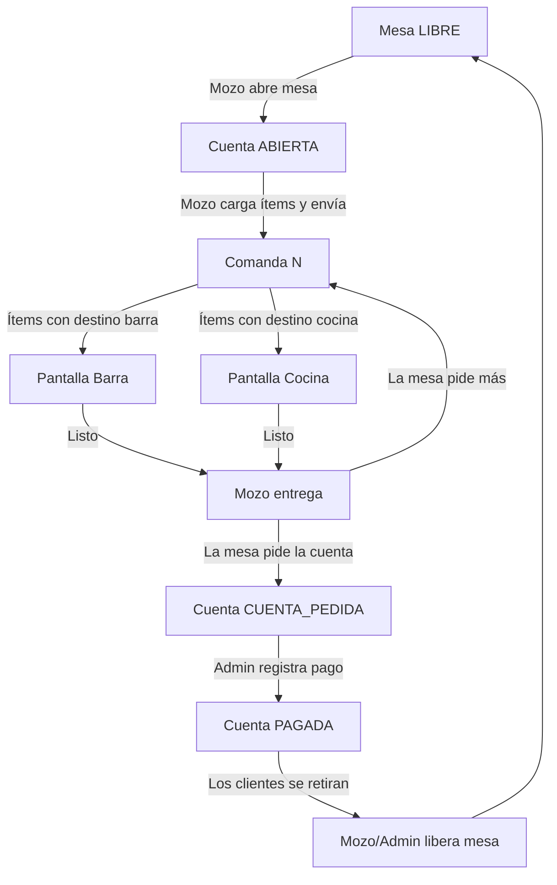
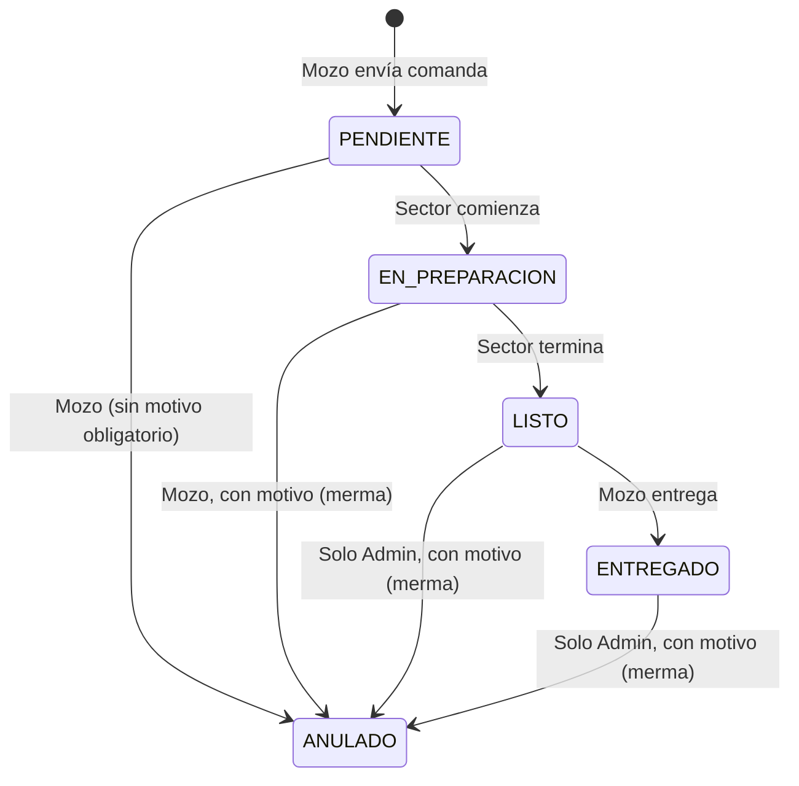

# 🍽️ PlatoYa

> **Sistema Web de Gestión de Mesas y Comandas Digitales para Bares con Cocina**  
> **Carrera:** Tecnicatura Universitaria en Programación a Distancia — UTN  
> **Entrega:** 2.ª — Diseño y módulos
> **Grupo:** 162  
> **Integrantes:** Bagni, Mattia | Petrei, Maximiliano  
> **Tutor asignado:** Londero, Oscar

---

## Documentación de la segunda entrega

Esta instancia presenta el análisis y diseño de PlatoYa.
No incluye implementación de frontend, backend ni lógica de negocio.

| Documento | Contenido |
|---|---|
| [Modelo de datos](docs/modelo-datos.md) | Diagrama entidad-relación, tablas, campos, tipos, claves, relaciones e índices. |
| [Esquema SQL](database/esquema.sql) | Definición de la estructura de PostgreSQL mediante DDL. |
| [Módulos funcionales](docs/modulos.md) | Descripción, prioridades y alcance de los módulos. |
| [Arquitectura](docs/arquitectura.md) | Componentes, tecnologías y organización por capas. |
| [Frontend](frontend/README.md) | Organización prevista de la aplicación web. |
| [Backend](backend/README.md) | Organización prevista de la API. |
| [Base de datos](database/README.md) | Alcance del esquema y evolución prevista. |

**Estado:** documentación preparada para revisión; pendiente de aprobación
del tutor y del comité.

El relevamiento con un establecimiento o usuario real continúa pendiente.
El caso de El Galeón se conserva como escenario hipotético y no como
evidencia obtenida de una entrevista.

---


## 📋 1. Identificación y Análisis de la Problemática

### 1.1 Dominio acotado
PlatoYa se enfoca en un único tipo de establecimiento: **bar con cocina y servicio de mesa con mozo**.
Se eligió este contexto porque presenta dos sectores de preparación bien diferenciados (**barra** y **cocina**) y un circuito completo de atención: mesa, comandas, preparación, entrega, cuenta y cobro.

Otros formatos (restaurantes con pasos, locales de pedido en mostrador, delivery) quedan fuera del modelo inicial y se analizan en la sección [9. Generalizaciones posibles](#-9-generalizaciones-posibles).

### 1.2 Escenario de referencia: "El Galeón" (caso hipotético)

> ⚠️ **Aclaración:** *El Galeón* es un **establecimiento ficticio**. El escenario fue **construido por el equipo**
> a partir del conocimiento general del rubro y **no surge de un relevamiento real**.
> Todo lo descrito en esta sección son **hipótesis de trabajo**.

| Aspecto                      | Descripción                                                                      |
|:-----------------------------|:---------------------------------------------------------------------------------|
| **Tipo**                     | Bar con cocina, servicio de mesa con mozo                                        |
| **Ubicación**                | Córdoba Capital                                                                  |
| **Capacidad**                | 18 mesas (60-70 cubiertos)                                                       |
| **Personal en horario pico** | 3 mozos, 1 bartender, 2 personas en cocina, 1 encargado que también cobra        |
| **Horario pico**             | Viernes y sábados, 21:00 a 00:00 h                                               |
| **Carta**                    | ~40 productos (cervezas, tragos, gaseosas, hamburguesas, pizzas, papas, picadas) |
| **Medios de cobro**          | Efectivo, débito, crédito, transferencia y QR                                    |

**Proceso ACTUAL de este tipo de establecimiento:**

1. **Toma del pedido:** el mozo anota en un talonario de comandas con copia. Suele escribir abreviado ("2 cer", "1 hamb s/ceb").
2. **Llegada a los sectores:** el mozo arranca la hoja, deja una copia en la barra y lleva otra a la cocina. Si el pedido mezcla bebidas y comida, a veces escribe dos papeles y a veces uno solo que "pasa" de un sector al otro.
3. **Pedidos adicionales:** cuando la mesa agrega productos, el mozo escribe una hoja nueva. Algunas veces anota lo nuevo en la hoja original (si todavía la tiene).
4. **Aviso de "listo":** la cocina toca un timbre o grita el número de mesa. La barra deja las bebidas en la punta y el mozo que pasa las lleva.
5. **Correcciones y cancelaciones:** son verbales. Se tacha la hoja si se llega a tiempo. Si la cocina ya empezó, el producto se descarta sin registro.
6. **Armado de la cuenta:** el encargado junta las copias de la mesa y suma a mano o las recarga en una planilla o sistema de caja.
7. **Puntos de falla supuestos:** hojas extraviadas, letra ilegible, cambios de precio no reflejados, productos servidos que no llegan a la caja (o viceversa), doble carga en la caja y demoras porque nadie sabe si un plato está listo.

### 1.3 Hipótesis
Los indicadores cuantitativos de la entrega anterior fueron **estimaciones del equipo sin fuente**. Se reformulan como hipótesis.

PlatoYa, además de resolver el problema, **genera los datos que hoy no existen** para medirlo.

| #  | Hipótesis                                                                                       | Cómo se validaría hoy (sin sistema)                           | Cómo lo mide PlatoYa                                                                             |
|:---|:------------------------------------------------------------------------------------------------|:--------------------------------------------------------------|:-------------------------------------------------------------------------------------------------|
| H1 | En horario pico, parte de los platos tarda más de 20 min entre la toma del pedido y la entrega. | Consulta al encargado y mozos; cronometrar mesas un viernes.  | Marcas de tiempo de cada cambio de estado del ítem (envío → en preparación → listo → entregado). |
| H2 | Una parte de lo consumido no llega a cobrarse, o se cobra mal.                                  | Comparar copias de comandas vs. tickets de caja de una noche. | La cuenta se calcula desde los ítems cargados. Los ítems anulados quedan registrados con motivo. |
| H3 | Se pierde rotación porque la cuenta tarda en llegar a la mesa.                                  | Consulta al encargado.                                        | Tiempo entre `CUENTA_PEDIDA` y `PAGADA`, y tiempo total de ocupación de la mesa.                 |
| H4 | Hay errores de interpretación de la comanda (letra, abreviaturas, observaciones).               | Consulta a cocina y barra.                                    | Cantidad de anulaciones con motivo "error de carga".                                             |
| H5 | Los productos preparados y luego cancelados no se registran.                                    | Consulta a cocina.                                            | Ítems anulados con preparación iniciada, marcados como merma.                                    |

### 1.4 Preguntas del relevamiento aplicadas al caso hipotético

> ⚠️ **Aclaración:** no se realizó un relevamiento con un establecimiento real.
> Las respuestas siguientes **no provienen de una entrevista**: son **hipotéticas**, construidas por el equipo para el escenario de *El Galeón*.

| # | Pregunta                                                | Respuesta hipotética (El Galeón)                                                                                                                                                                 | Qué resuelve PlatoYa                                                                                                |
|:--|:--------------------------------------------------------|:-------------------------------------------------------------------------------------------------------------------------------------------------------------------------------------------------|:--------------------------------------------------------------------------------------------------------------------|
| 1 | ¿Cómo toman actualmente una comanda?                    | El mozo anota a mano en un talonario con copia, con abreviaturas y observaciones al margen ("s/ceb").                                                                                            | Carga en pantalla desde la carta, con observación por línea (RN-11, RN-12).                                         |
| 2 | ¿Cómo llega a cocina y barra?                           | El mozo camina con las copias: una a la barra y otra a la cocina. Si el pedido es mixto, a veces una sola hoja pasa por ambos sectores.                                                          | Cada ítem se envía automáticamente a su sector según el destino (RN-13, RN-14).                                     |
| 3 | ¿Qué sucede cuando un cliente agrega productos después? | Se escribe una hoja nueva o se agrega a la hoja original si el mozo todavía la tiene. La caja termina recibiendo papeles sueltos de la misma mesa.                                               | Cada agregado es una comanda nueva dentro de la misma cuenta (RN-09).                                               |
| 4 | ¿Cómo se informa que algo está listo?                   | La cocina toca un timbre o grita el número de mesa. La barra deja las bebidas en la punta. Lo lleva el mozo que pase.                                                                            | El sector marca `LISTO` y el mozo lo ve en su pantalla (RN-15, RN-16).                                              |
| 5 | ¿Cómo se corrigen errores o cancelaciones?              | Verbalmente. Si se llega a tiempo, se tacha la hoja. Si la cocina ya empezó, se descarta sin dejar registro.                                                                                     | Anulación registrada con usuario, motivo y marca de merma (RN-17 a RN-21).                                          |
| 6 | ¿Cómo se arma finalmente la cuenta?                     | El encargado junta las copias de la mesa y suma a mano o las vuelve a cargar en la caja.                                                                                                         | El total se calcula solo con los ítems no anulados, a precio histórico (RN-22, RN-24).                              |
| 7 | ¿Dónde aparecen demoras, errores o doble carga?         | Hojas extraviadas, letra ilegible, platos listos que esperan porque nadie avisa, precios desactualizados en la caja, productos servidos que no se cobran y carga duplicada entre comanda y caja. | Registro único desde la toma del pedido hasta el cobro, con fechas en cada estado para medir las hipótesis H1 a H5. |

---

## 👥 2. Actores y Roles

| Rol        | Responsabilidades                                                                                                                                                                                           |
|:-----------|:------------------------------------------------------------------------------------------------------------------------------------------------------------------------------------------------------------|
| **MOZO**   | Abre mesas, carga ítems, envía comandas, ve el estado de sus pedidos, marca ítems como entregados, anula ítems pendientes o en preparación, solicita la cuenta. Cualquier mozo puede operar cualquier mesa. |
| **COCINA** | Ve solo los ítems con destino cocina, ordenados por hora de envío. Cambia su estado a *En preparación* y *Listo*.                                                                                           |
| **BARRA**  | Igual que cocina, pero para los ítems con destino barra.                                                                                                                                                    |
| **ADMIN**  | Administra mesas, categorías, productos y usuarios. Cumple la función de caja: registra el pago, cierra cuentas y libera mesas. Es el único que puede anular ítems ya listos o entregados.                  |

> En el MVP, la caja está dentro del rol `ADMIN`.

---

## 🧩 3. Modelo del Proceso

### 3.1 Circuito principal



**Idea central:** una **Mesa** tiene una cuenta abierta, y esa cuenta acumula **varias Comandas**.

Cada vez que el mozo envía productos a preparar se genera una comanda nueva, y una comanda enviada no se modifica.
Cada comanda tiene **ítems**, y cada ítem va a un sector (barra o cocina) y tiene **su propio estado**.

### 3.2 Entidades principales

| Entidad         | Datos relevantes                                                                                                                                                                             | Notas                                                           |
|:----------------|:---------------------------------------------------------------------------------------------------------------------------------------------------------------------------------------------|:----------------------------------------------------------------|
| **Usuario**     | nombre, usuario, contraseña (hash), rol, fecha_baja                                                                                                                                          | Roles: `ADMIN`, `MOZO`, `COCINA`, `BARRA`.                      |
| **Mesa**        | número, capacidad, estado, fecha_baja                                                                                                                                                        | Estado: `LIBRE` / `OCUPADA`.                                    |
| **Categoria**   | nombre, destino por defecto, fecha_baja                                                                                                                                                      | Destino: `BARRA` / `COCINA`.                                    |
| **Producto**    | nombre, precio, categoría, destino (opcional, cambia el de la categoría), fecha_baja                                                                                                         | Nunca se borra físicamente.                                     |
| **Cuenta**      | mesa, mozo que la abrió, estado, fecha de apertura, fecha de cierre                                                                                                                          | Estado: `ABIERTA` → `CUENTA_PEDIDA` → `PAGADA` (o `ANULADA`).   |
| **Comanda**     | cuenta, mozo que la envió, número correlativo en la cuenta, fecha de envío                                                                                                                   | No tiene estado propio: se calcula a partir de sus ítems.       |
| **ItemComanda** | comanda, producto, **nombre_producto**, **precio_unitario**, **destino**, cantidad, observación, estado, fechas de cada cambio de estado, datos de anulación (fecha, usuario, motivo, merma) | Nombre, precio y destino se **copian** al momento de la carga.  |
| **Pago**        | cuenta, monto, medio de pago, fecha, usuario que lo registró                                                                                                                                 | Medios: `EFECTIVO`, `DEBITO`, `CREDITO`, `TRANSFERENCIA`, `QR`. |

### 3.3 Estados del ítem



**Estado calculado de la comanda:**

Se evalúa en el siguiente orden:

1. **Anulada:** todos sus ítems están `ANULADO`.
2. **Completa:** todos sus ítems no anulados están `ENTREGADO`.
3. **Pendiente:** todos sus ítems no anulados están `PENDIENTE`.
4. **En curso:** cualquier combinación restante.

Esta definición contempla, por ejemplo, una comanda con algunos ítems
entregados y otros todavía pendientes.

---

## 📐 4. Reglas de Negocio

**Mesas y cuentas**
- **RN-01:** Una mesa tiene como máximo una cuenta activa a la vez.
  Se consideran activas las cuentas en estado `ABIERTA` o `CUENTA_PEDIDA`.
  Las cuentas `PAGADA` o `ANULADA` se conservan como historial.
- **RN-02:** Al abrir una cuenta, la mesa pasa a `OCUPADA`.
- **RN-03:** **Registrar el pago no libera la mesa.**
    - La cuenta pasa a `PAGADA` y queda cerrada definitivamente, pero la mesa sigue `OCUPADA` hasta que un mozo o el Admin la libera manualmente.
    - Se permite que los clientes paguen y se queden un rato más, algo muy común en este tipo de establecimientos.
- **RN-04:** Si una mesa con la cuenta pagada pide algo más, se abre **una cuenta nueva** sobre la misma mesa. Una cuenta pagada nunca se reabre.
- **RN-05:** Si la mesa pide algo más mientras la cuenta está `CUENTA_PEDIDA` (y todavía no pagó), la cuenta vuelve a `ABIERTA`.
- **RN-06:** Una mesa solo puede liberarse si no tiene cuentas `ABIERTA` o `CUENTA_PEDIDA`.
- **RN-07:** Cualquier mozo puede operar cualquier mesa. La cuenta registra qué mozo la abrió y cada comanda registra qué mozo la envió.
- **RN-08:** Solo el Admin puede anular una cuenta completa (por ejemplo, una mesa abierta por error y sin consumos).

**Comandas e ítems**
- **RN-09:** Cada envío de productos genera una **comanda nueva**. Una comanda enviada **no se modifica**.
- **RN-10:** Un ítem no se edita una vez enviado. Para corregir la cantidad o la observación, se anula y se carga de nuevo en otra comanda.
- **RN-11:** El mismo producto puede aparecer en **varias líneas** de una comanda cuando las observaciones son distintas (ej.: `Hamburguesa completa ×2` y `Hamburguesa completa ×1 — sin cebolla`).
- **RN-12:** La observación es **texto libre opcional** y no modifica el precio.
- **RN-13:** El destino del ítem se toma del producto (o de su categoría, si el producto no tiene uno propio) y **se copia en el ítem** al cargarlo.
- **RN-14:** Cada sector ve **solo los ítems de su destino**, agrupados por comanda y ordenados por hora de envío.
- **RN-15:** El estado se maneja **por ítem**. En una misma comanda, las bebidas pueden estar `LISTO` mientras los platos siguen `EN_PREPARACION`.
- **RN-16:** El sector cambia el estado a `EN_PREPARACION` y `LISTO`. El mozo lo cambia a `ENTREGADO`.

**Anulaciones**
- **RN-17:** Un ítem anulado nunca se borra: queda `ANULADO`, con fecha y usuario responsable, y no se cobra. El motivo es opcional si estaba `PENDIENTE` y obligatorio si la   preparación ya había comenzado.
- **RN-18:** Un ítem `PENDIENTE` lo puede anular el mozo sin autorización.
- **RN-19:** Un ítem `EN_PREPARACION` lo puede anular el mozo con **motivo obligatorio**. Queda marcado como **merma**.
- **RN-20:** Un ítem `LISTO` o `ENTREGADO` solo lo puede anular el **Admin**, con motivo obligatorio. Queda marcado como merma.
- **RN-21:** El sector ve los ítems anulados **tachados** para no prepararlos.

**Precios y valores históricos**
- **RN-22:** El ítem guarda el **nombre y el precio unitario vigentes al momento de cargarlo**. Si luego cambia el precio del producto, las cuentas existentes no se modifican.
- **RN-23:** Productos, categorías, mesas y usuarios **se dan de baja de forma lógica** (con `fecha_baja`) y dejan de ofrecerse, pero se mantienen para el historial.

**Cuenta y pago**
- **RN-24:** Total de la cuenta = Σ (cantidad × precio_unitario) de todos los ítems **no anulados** de todas sus comandas.
- **RN-25:** Para registrar el pago, todos los ítems deben estar `ENTREGADO` o `ANULADO`.
- **RN-26:** Se registra **un único pago por cuenta**, por el total, con medio de pago y fecha. Al registrarlo, la cuenta pasa a `PAGADA`.
- **RN-27:** Quedan fuera del MVP: dividir la cuenta, pagos parciales, propinas, descuentos, factura fiscal y arqueo de caja.

### Precisiones del diseño para revisión

- Una cuenta pagada no admite nuevos consumos ni anulaciones que
  modifiquen su importe.
- Se propone que cada línea de comanda comparta un único estado para
  todas sus unidades, sin entregas ni anulaciones parciales de la línea.
- Se propone permitir la anulación de una cuenta únicamente si no tiene
  consumos cobrables ni pagos registrados.
- Se propone cerrar las cuentas de total cero mediante anulación
  justificada, sin generar un pago ficticio.

Estas precisiones están pendientes de validación con el tutor.
Las políticas operativas también deberán contrastarse con un usuario real.
---

## 🧪 5. Caso de Análisis

> Los precios son **ficticios** y solo sirven para ilustrar el cálculo: Cerveza (pinta) $6.500 · Gaseosa $3.500 · Hamburguesa completa $14.000 · Porción de papas $7.000.

**Situación:** son las 21:30 en El Galeón y la **Mesa 7** (4 personas) hace su primer pedido.

### 5.1 Secuencia

| Hora  | Evento                                           | Qué ve el **Mozo**                                             | Qué ve **Barra**                    | Qué ve **Cocina**                                                 |
|:------|:-------------------------------------------------|:---------------------------------------------------------------|:------------------------------------|:------------------------------------------------------------------|
| 21:28 | El mozo abre la Mesa 7                           | Mesa 7 `OCUPADA`, Cuenta #1 `ABIERTA`                          | —                                   | —                                                                 |
| 21:30 | Envía **Comanda 1**                              | C1: 4 líneas `PENDIENTE`                                       | C1 · Mesa 7: Cerveza ×2, Gaseosa ×1 | C1 · Mesa 7: Hamb. completa ×2, Hamb. completa ×1 *(sin cebolla)* |
| 21:31 | Barra y cocina empiezan                          | Bebidas y hamburguesas `EN_PREPARACION`                        | Sus 2 líneas `EN_PREPARACION`       | Sus 2 líneas `EN_PREPARACION`                                     |
| 21:34 | **Barra termina primero**                        | Bebidas `LISTO` · hamburguesas `EN_PREPARACION`                | Sus líneas `LISTO`                  | Sin cambios                                                       |
| 21:35 | Mozo lleva las bebidas                           | Bebidas `ENTREGADO`                                            | Desaparecen de pendientes           | Sin cambios                                                       |
| 21:40 | La mesa agrega: envía **Comanda 2**              | C2: Cerveza ×1, Papas ×1 `PENDIENTE`                           | C2 · Mesa 7: Cerveza ×1             | C2 · Mesa 7: Papas ×1                                             |
| 21:42 | Cocina empieza las papas                         | Papas `EN_PREPARACION`                                         | —                                   | Papas `EN_PREPARACION`                                            |
| 21:43 | Barra termina la cerveza y el mozo la entrega    | Cerveza de C2 `ENTREGADO`                                      | Desaparece de pendientes            | —                                                                 |
| 21:44 | **La mesa cancela las papas**                    | El mozo anula con motivo "cliente desiste" → `ANULADO` (merma) | —                                   | Papas **tachadas** (`ANULADO`)                                    |
| 21:48 | Cocina termina las hamburguesas                  | Hamburguesas `LISTO`                                           | —                                   | Sus líneas de C1 `LISTO`                                          |
| 21:49 | Mozo las entrega                                 | Hamburguesas `ENTREGADO` · C1 y C2 **Completas**               | —                                   | Desaparecen de pendientes                                         |
| 22:30 | La mesa pide la cuenta                           | Cuenta #1 `CUENTA_PEDIDA`                                      | —                                   | —                                                                 |
| 22:33 | El Admin registra el pago (QR, $65.000)          | Cuenta #1 `PAGADA` · Mesa 7 sigue `OCUPADA`                    | —                                   | —                                                                 |
| 22:50 | Los clientes se retiran y el mozo libera la mesa | Mesa 7 `LIBRE`                                                 | —                                   | —                                                                 |

### 5.2 Respuestas al ejercicio

- **¿Cuántas comandas existen?** **Dos**, dentro de **una sola cuenta**. La Comanda 1 tiene 4 líneas y la Comanda 2 tiene 2.
- **¿Qué ve cada sector?** Barra ve solo cervezas y gaseosa, y cocina solo hamburguesas y papas. Ninguno ve los ítems del otro.
- **¿Qué estados se generan?** Cada línea recorre sus propios estados. En C1, las bebidas llegan a `ENTREGADO` mientras las hamburguesas siguen `EN_PREPARACION` (RN-15). En C2, la cerveza llega a `ENTREGADO` y las papas terminan en `ANULADO`.
- **¿Qué puede cancelarse?** Las papas estaban `EN_PREPARACION`, así que el mozo las puede anular con motivo y quedan registradas como **merma** (RN-19). No se borran y no se cobran.
- **¿Cómo se calcula la cuenta?**

| Comanda | Ítem                                 | Cant. | P. unit. | Estado              |    Subtotal |
|:-------:|:-------------------------------------|:-----:|---------:|:--------------------|------------:|
|    1    | Cerveza (pinta)                      |   2   |   $6.500 | Entregado           |     $13.000 |
|    1    | Gaseosa                              |   1   |   $3.500 | Entregado           |      $3.500 |
|    1    | Hamburguesa completa                 |   2   |  $14.000 | Entregado           |     $28.000 |
|    1    | Hamburguesa completa — *sin cebolla* |   1   |  $14.000 | Entregado           |     $14.000 |
|    2    | Cerveza (pinta)                      |   1   |   $6.500 | Entregado           |      $6.500 |
|    2    | ~~Porción de papas~~                 |   1   |   $7.000 | **Anulado (merma)** |          $0 |
|         |                                      |       |          | **Total**           | **$65.000** |

---

## 🛠️ 6. Stack Tecnológico y Conocimiento del Equipo

### 6.1 Stack seleccionado

| Capa                           | Tecnología                                  | Justificación                                                                                              |
|:-------------------------------|:--------------------------------------------|:-----------------------------------------------------------------------------------------------------------|
| **Frontend**                   | Angular + TypeScript                        | Componentes reutilizables (mesas, comandas, pantallas de sector). Ambos integrantes tienen nivel avanzado. |
| **Backend**                    | Java + Spring Boot                          | Maneja bien la lógica de estados y validaciones de reglas de negocio, con una API REST tipada.             |
| **Base de datos**              | PostgreSQL + Flyway                         | Integridad transaccional entre cuentas, comandas, ítems y pagos. Flyway versiona el esquema.               |
| **Autenticación**              | Spring Security + JWT                       | Control de acceso por rol (`ADMIN`, `MOZO`, `COCINA`, `BARRA`).                                            |
| **Actualización de pantallas** | Polling (cada 5 s inicialmente) | Consulta periódica de estados. El intervalo se ajustará durante las pruebas. WebSocket queda como deseable. |
| **Despliegue** | Docker + PaaS (proveedor a definir) | Entorno reproducible. Proveedor pendiente de selección según compatibilidad, límites y costos. |

### 6.2 Nivel de conocimiento del stack

Escala: *Nulo · Básico (cursada) · Intermedio (proyecto propio) · Avanzado (uso laboral)*

| Tecnología      | Petrei, Maximiliano | Bagni, Mattia |
|:----------------|:-------------------:|:-------------:|
| Java            |      Avanzado       |    Básico     |
| Spring Boot     |      Avanzado       |    Básico     |
| Spring Security |      Avanzado       |    Básico     |
| Angular         |      Avanzado       |   Avanzado    |
| TypeScript      |      Avanzado       |   Avanzado    |
| PostgreSQL      |      Avanzado       |   Avanzado    |
| Docker          |      Avanzado       |   Avanzado    |
| Deployment      |      Avanzado       |   Avanzado    |

**Conclusión:** el equipo cuenta con conocimientos del stack seleccionado, con distintos niveles de experiencia. Maximiliano tiene mayor experiencia en Java, Spring Boot y Spring Security; Mattia deberá profundizar esas tecnologías con acompañamiento del equipo. Ambos participarán en las distintas capas, distribuyendo tareas según experiencia y disponibilidad.

---

## 🚀 7. Alcance del Proyecto

### 7.1 Mínimo Viable (MVP): el circuito principal
> **Mesa → Comanda → Cocina/Barra → Estado → Entrega → Cuenta → Cierre.** Si hay que recortar, se recortan los deseables y **nunca** este circuito.

- **Autenticación y roles:** login con JWT y los 4 roles.
- **ABM:** mesas, categorías (con destino), productos (con precio y destino opcional) y usuarios, con baja lógica.
- **Módulo Mozo:** abrir mesa, cargar ítems con cantidad y observación, enviar comanda, ver el estado por ítem, marcar como entregado, anular (según RN-18 y RN-19) y pedir la cuenta.
- **Módulo Cocina / Barra:** pantalla por sector con sus ítems ordenados por hora de envío, cambio de estado y anulados tachados.
- **Módulo Caja (Admin):** detalle y total de la cuenta, registro del pago con medio de pago, cierre de la cuenta, liberación de la mesa y anulaciones reservadas al Admin.

### 7.2 Deseables
- Métricas básicas: facturación diaria, productos más vendidos, tiempos de preparación y merma. Se apoyan en los datos que genera el MVP.
- Actualización en tiempo real con **WebSocket** y avisos visuales o sonoros cuando un ítem pasa a `LISTO`.
- Reservas de mesas.

### 7.3 Fuera de alcance
- Pasarelas de pago, posnet o QR integrados (solo se **registra** el medio de pago).
- Dividir la cuenta, pagos parciales, propinas, descuentos, facturación fiscal y arqueo de caja.
- Modificadores de producto con costo adicional.
- Control de stock e insumos.
- Impresión térmica y hardware específico.

---

## 🧱 8. Prueba vertical sencilla

> **Etapa posterior:** este apartado describe una prueba planificada.
> No forma parte de la implementación de esta entrega.
> Se comenzará después de la aprobación de la etapa de análisis y diseño,
> conforme a la consigna de la segunda entrega.

El primer objetivo técnico es un recorrido de punta a punta, mínimo pero funcionando:

> **abrir mesa → cargar producto → enviar comanda → cocina la recibe → cambia estado → mozo visualiza el cambio**

**Criterios de aceptación**
1. Un usuario `MOZO` inicia sesión y abre una mesa `LIBRE`, que pasa a `OCUPADA` con una cuenta `ABIERTA`.
2. El mozo carga un producto de cocina (con cantidad y observación) y envía la comanda.
3. Un usuario `COCINA` ve la comanda en su pantalla, con la mesa, la hora de envío y la observación.
4. Cocina cambia el ítem a `EN_PREPARACION` y luego a `LISTO`.
5. Sin recargar manualmente, la pantalla del mozo consulta los estados cada 5 segundos mediante polling. Se verificará el tiempo efectivo de actualización durante las pruebas.
6. Todo corre con `docker-compose up`, con datos de prueba cargados por Flyway (mesas, productos y usuarios).

---

## 🔭 9. Generalizaciones Posibles

Surgieron al analizar la revisión de la propuesta. **No forman parte del MVP**, pero el modelo se diseñó para no impedirlas:

- **Pedido y pago en mostrador (*fast casual*):** el cliente pide y paga en la caja y espera en su mesa. El modelo de Comanda e Ítem con estado por sector se mantiene igual. Lo que cambia es que el pago pasa al comienzo y la mesa se vuelve opcional.
- **Más sectores de preparación** (parrilla, postres, cafetería): el destino podría pasar de un valor fijo a una entidad configurable.
- **Restaurante con pasos** (entrada, principal, postre): requeriría agregar a la comanda la indicación de en qué momento se prepara cada paso.
- **Take away y delivery:** cuentas sin mesa asociada.

---

## 📁 10. Estructura del repositorio — Segunda entrega

```text
PlatoYa/
├── README.md
├── frontend/
│   └── README.md
├── backend/
│   └── README.md
├── database/
│   ├── README.md
│   └── esquema.sql
└── docs/
    ├── modelo-datos.md
    ├── modulos.md
    └── arquitectura.md
```

En esta entrega, frontend y backend contienen únicamente documentación
de su organización prevista.

El esquema SQL es un entregable de diseño. La aplicación y la
configuración de ejecución se incorporarán después de la aprobación.