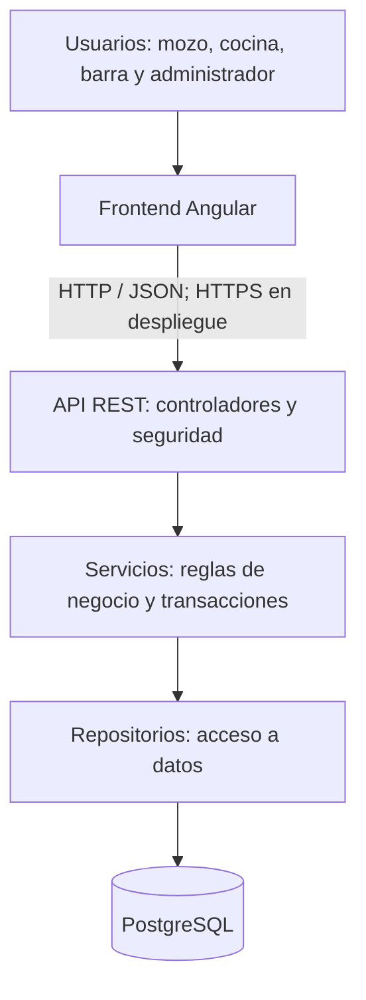

# Arquitectura del proyecto — PlatoYa

**Entrega:** Segunda entrega — Diseño y módulos  
**Estado:** Diseño propuesto, pendiente de aprobación del tutor.

## 1. Arquitectura elegida

PlatoYa utilizará una arquitectura cliente-servidor, con una aplicación
web Angular y una API REST desarrollada con Java y Spring Boot.

El backend será un monolito organizado en capas.
La información se almacenará en una base de datos relacional PostgreSQL.

Los módulos funcionales compartirán el mismo backend y la misma base
de datos. No se utilizarán microservicios.

Esta organización permite separar responsabilidades sin incorporar
la complejidad operativa de varios servicios independientes.

## 2. Componentes principales



El frontend no accederá directamente a la base de datos.
Todas las operaciones pasarán por la API.

## 3. Tecnologías seleccionadas

| Componente | Tecnología | Justificación |
|---|---|---|
| Interfaz web | Angular y TypeScript | Organización por componentes, formularios y vistas diferenciadas por rol. |
| API | Java y Spring Boot | Desarrollo de servicios REST y centralización de reglas de negocio. |
| Seguridad | Spring Security y JWT | Autenticación y autorización de operaciones según el rol. |
| Persistencia | Spring Data JPA | Implementación propuesta para organizar el acceso a datos mediante repositorios. |
| Base de datos | PostgreSQL | Relaciones, restricciones e integridad transaccional entre cuentas, comandas, ítems y pagos. |
| Versionado de BD | Flyway | Registro y aplicación ordenada de cambios del esquema durante la implementación. |
| Actualización de pantallas | Polling mediante HTTP | Solución inicial sencilla para consultar cambios de estado sin recarga manual. |
| Entorno de ejecución | Docker y Docker Compose | Entorno reproducible para frontend, backend y base de datos en la etapa de implementación. |
| Control de versiones | Git y GitHub | Repositorio único para documentación y futuro código fuente. |

Spring Data JPA completa la decisión de persistencia del stack original.
Su incorporación queda sujeta a la revisión del equipo y del tutor.

Las versiones concretas se fijarán al iniciar la implementación
y se documentarán en los archivos de configuración.

El proveedor de despliegue todavía no está seleccionado.
Render y Railway fueron considerados en la propuesta inicial;
la elección dependerá de compatibilidad, límites y costos.
No se presupone un servicio gratuito permanente.

## 4. Organización del frontend

El frontend se organizará por funcionalidades.

### Vistas previstas

- Inicio de sesión.
- Administración de usuarios.
- Administración de mesas.
- Administración de categorías y productos.
- Atención de mesas y carga de comandas.
- Pantalla de cocina.
- Pantalla de barra.
- Seguimiento y entrega de pedidos.
- Consulta de cuenta y registro del pago.

### Responsabilidades

- Mostrar la información correspondiente al rol.
- Capturar productos, cantidades y observaciones.
- Validar campos para orientar al usuario.
- Enviar solicitudes a la API.
- Mostrar errores y resultados de las operaciones.
- Consultar periódicamente los estados de los ítems.

Las validaciones de la interfaz no reemplazarán las del backend.
Ocultar botones tampoco será una medida suficiente de autorización.

## 5. Capas del backend

| Capa | Responsabilidad |
|---|---|
| Controladores | Recibir solicitudes HTTP, validar su estructura y devolver respuestas. |
| DTO | Definir los datos de entrada y salida sin exponer directamente las entidades de persistencia. |
| Servicios | Aplicar reglas de negocio, coordinar operaciones y establecer transacciones. |
| Entidades | Representar los datos y relaciones persistentes. |
| Repositorios | Consultar y persistir información mediante Spring Data JPA. |
| Seguridad | Autenticar usuarios y verificar permisos por rol. |
| Manejo de errores | Convertir errores de validación y negocio en respuestas comprensibles. |

### Distribución propuesta

El backend se organizará por módulo funcional y, dentro de cada módulo,
se separarán controladores, servicios, DTO, entidades y repositorios
según corresponda.

Esto mantiene juntas las partes de una funcionalidad y conserva
la separación de responsabilidades por capas.

No se duplicarán entidades compartidas entre módulos.

## 6. Reglas de negocio y transacciones

Los servicios serán responsables de aplicar las reglas del README
y del modelo de datos.

Operaciones que requerirán transacciones:

- Apertura de cuenta y ocupación de mesa.
- Creación de una comanda junto con todos sus ítems.
- Anulación de un ítem y registro de sus datos de auditoría.
- Registro del pago y cierre de la cuenta.

El backend deberá impedir operaciones incompatibles sobre los mismos
datos cuando varios usuarios trabajen simultáneamente.

Por ejemplo, una anulación debe verificar el estado vigente del ítem
dentro de la operación: no alcanza con el estado mostrado previamente
en la pantalla del mozo.

La estrategia concreta de bloqueo o control de versiones se definirá
durante la implementación y se verificará mediante pruebas.

La base de datos complementará estas validaciones mediante claves,
restricciones e índices. No todas las reglas quedan resueltas por el SQL.

## 7. Autenticación y autorización

Se utilizarán los roles definidos en la propuesta:

| Rol | Acceso principal |
|---|---|
| ADMIN | Administración, registro de pagos y anulaciones reservadas al administrador. |
| MOZO | Atención de mesas, comandas, seguimiento, entrega y anulaciones permitidas. |
| COCINA | Consulta y actualización de ítems destinados a cocina. |
| BARRA | Consulta y actualización de ítems destinados a barra. |

- Las contraseñas se almacenarán mediante hash.
- El backend verificará la autenticación y los permisos.
- Los tokens JWT tendrán vencimiento y validación de firma.
- No se incluirán contraseñas reales, claves de firma ni credenciales en Git.
- Las credenciales del entorno se configurarán externamente.
- El frontend recibirá únicamente los datos necesarios.
- La política de almacenamiento y renovación de tokens se definirá
  antes de implementar la autenticación.

## 8. Actualización de estados

El MVP utilizará polling: las pantallas consultarán periódicamente
la API para obtener cambios.

Se propone un intervalo inicial de 5 segundos durante el uso
de las vistas de trabajo. Se ajustará según pruebas de funcionamiento
y carga.

Este intervalo no garantiza por sí mismo un tiempo máximo de respuesta:
también influyen la red y el procesamiento del servidor.

Las solicitudes periódicas se detendrán al abandonar la vista
o cerrar la sesión, y se evitarán solicitudes superpuestas.

WebSocket y las notificaciones sonoras quedan fuera del MVP,
como mejoras deseables.

## 9. Persistencia y evolución del esquema

Las entidades principales serán:

- Usuario.
- Mesa.
- Categoría.
- Producto.
- Cuenta.
- Comanda.
- Ítem de comanda.
- Pago.

El diseño detallado se encuentra en
[modelo-datos.md](modelo-datos.md).

El archivo [esquema.sql](../database/esquema.sql) representa
la estructura propuesta para esta entrega.

Después de la aprobación, el esquema se incorporará al mecanismo
de migraciones Flyway del backend. Los cambios posteriores se
registrarán como nuevas migraciones, evitando modificar migraciones
ya aplicadas en entornos compartidos.

Los datos históricos de consumos conservarán nombre, precio y destino,
aunque cambie el catálogo.

## 10. Estructura del repositorio

```text
PlatoYa/
├── README.md
├── frontend/
│   └── README.md
├── backend/
│   └── README.md
├── database/
│   ├── README.md
│   └── esquema.sql
└── docs/
    ├── modelo-datos.md
    ├── modulos.md
    └── arquitectura.md
```

| Carpeta | Contenido en esta entrega |
|---|---|
| frontend | Descripción de la estructura prevista, sin implementación. |
| backend | Descripción de la estructura prevista, sin implementación. |
| database | Esquema SQL y explicación de su alcance. |
| docs | Diseño de datos, diagrama, módulos y arquitectura. |

Los directorios internos de la aplicación y la configuración de Docker
se incorporarán en la etapa de implementación.

## 11. Justificación y viabilidad

La arquitectura conserva el stack presentado por el equipo.

Un único backend simplifica el desarrollo, las transacciones y el
despliegue para un proyecto realizado por dos integrantes.

La separación por capas permite mantener las reglas de negocio
independientes de las pantallas y del manejo de solicitudes HTTP.

Según la matriz de conocimientos del README, Maximiliano cuenta con
mayor experiencia en Java, Spring Boot y Spring Security.
Mattia deberá profundizar esas tecnologías con acompañamiento del equipo.

Se priorizará el circuito gastronómico principal antes de incorporar
reportes, reservas o comunicación mediante WebSocket.

## 12. Estado de esta entrega

Este documento describe decisiones de diseño.
No acredita que el sistema esté implementado ni desplegado.

La prueba vertical planteada en el README se realizará después
de la aprobación de esta etapa, conforme a la consigna de la segunda entrega.

## 13. Documentación relacionada

- [Presentación del proyecto](../README.md)
- [Diseño de base de datos](modelo-datos.md)
- [Módulos y prioridades](modulos.md)
- [Esquema SQL](../database/esquema.sql)