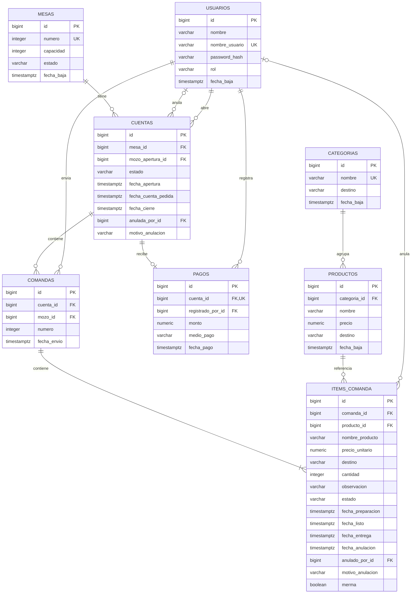

# Diseño de base de datos — PlatoYa

**Entrega:** Segunda entrega — Diseño y módulos  
**Motor seleccionado:** PostgreSQL  
**Estado:** Propuesta de diseño pendiente de aprobación del tutor.

## 1. Alcance

El modelo representa un bar con cocina y atención por mozo.

Una mesa puede tener varias cuentas a lo largo del tiempo, pero solo una
activa. Cada cuenta agrupa las comandas enviadas durante la atención.
Cada comanda contiene líneas de productos con destino y estado propios.

El pago se registra dentro del sistema, sin integración con pasarelas
externas. No se incluyen pagos parciales, división de cuentas ni stock.

Las reglas se basan en la propuesta del equipo. Su validación con un
establecimiento o usuario real continúa pendiente.

## 2. Diagrama entidad-relación

Las longitudes, precisión, nulabilidad y restricciones se detallan a continuación.

## 3. Convenciones

- Las claves primarias utilizan `BIGINT GENERATED ALWAYS AS IDENTITY`.
- Todas las columnas son obligatorias salvo las indicadas como opcionales.
- Los importes utilizan `NUMERIC(12,2)` para evitar errores de punto flotante.
- Todos los importes del MVP se expresan en pesos argentinos.
- Las fechas utilizan `TIMESTAMPTZ`.
- Los estados, roles y destinos se restringen mediante `CHECK`.
- Las claves foráneas utilizan `ON DELETE RESTRICT`.
- Los registros históricos no se eliminan en cascada.
- Las bajas de usuarios, mesas, categorías y productos son lógicas.

## 4. Diccionario de datos

### 4.1 usuarios

| Campo | Tipo | Restricciones y descripción |
|---|---|---|
| id | BIGINT | PK, identidad. |
| nombre | VARCHAR(100) | Nombre de la persona. |
| nombre_usuario | VARCHAR(50) | Único; identificador de acceso. |
| password_hash | VARCHAR(255) | Hash de contraseña; nunca texto plano. |
| rol | VARCHAR(10) | ADMIN, MOZO, COCINA o BARRA. |
| fecha_baja | TIMESTAMPTZ | Opcional. NULL indica usuario activo. |

### 4.2 mesas

| Campo | Tipo | Restricciones y descripción |
|---|---|---|
| id | BIGINT | PK, identidad. |
| numero | INTEGER | Único y mayor que cero. |
| capacidad | INTEGER | Mayor que cero. |
| estado | VARCHAR(10) | LIBRE u OCUPADA. Inicial: LIBRE. |
| fecha_baja | TIMESTAMPTZ | Opcional. NULL indica mesa habilitada. |

La ocupación se conserva separada del estado de la cuenta:
registrar un pago no libera automáticamente la mesa.

### 4.3 categorias

| Campo | Tipo | Restricciones y descripción |
|---|---|---|
| id | BIGINT | PK, identidad. |
| nombre | VARCHAR(80) | Único. |
| destino | VARCHAR(10) | COCINA o BARRA; destino por defecto. |
| fecha_baja | TIMESTAMPTZ | Opcional. |

### 4.4 productos

| Campo | Tipo | Restricciones y descripción |
|---|---|---|
| id | BIGINT | PK, identidad. |
| categoria_id | BIGINT | FK a categorias.id. |
| nombre | VARCHAR(120) | Nombre actual del producto. |
| precio | NUMERIC(12,2) | Mayor o igual que cero. |
| destino | VARCHAR(10) | Opcional. COCINA o BARRA. |
| fecha_baja | TIMESTAMPTZ | Opcional. |

Si el destino del producto es NULL, se utiliza el de su categoría.
Un producto o una categoría dados de baja no se ofrecen para nuevos consumos.

### 4.5 cuentas

| Campo | Tipo | Restricciones y descripción |
|---|---|---|
| id | BIGINT | PK, identidad. |
| mesa_id | BIGINT | FK a mesas.id. |
| mozo_apertura_id | BIGINT | FK a usuarios.id. |
| estado | VARCHAR(15) | ABIERTA, CUENTA_PEDIDA, PAGADA o ANULADA. Inicial: ABIERTA. |
| fecha_apertura | TIMESTAMPTZ | Inicial: CURRENT_TIMESTAMP. |
| fecha_cuenta_pedida | TIMESTAMPTZ | Opcional. Momento de la última solicitud de cuenta. |
| fecha_cierre | TIMESTAMPTZ | Opcional. Se completa al pagar o anular. |
| anulada_por_id | BIGINT | Opcional. FK a usuarios.id. |
| motivo_anulacion | VARCHAR(255) | Opcional; obligatorio al anular. |

Solo puede existir una cuenta en estado ABIERTA o CUENTA_PEDIDA por mesa.

Si se agregan productos después de pedir la cuenta, vuelve a ABIERTA.
Se conserva la fecha de la última solicitud; una nueva solicitud la actualiza.

Una cuenta PAGADA no se reabre ni admite cambios en sus consumos.
Una nueva atención o pedido posterior al pago genera otra cuenta.

### 4.6 comandas

| Campo | Tipo | Restricciones y descripción |
|---|---|---|
| id | BIGINT | PK, identidad. |
| cuenta_id | BIGINT | FK a cuentas.id. |
| mozo_id | BIGINT | FK a usuarios.id. |
| numero | INTEGER | Mayor que cero; correlativo dentro de la cuenta. |
| fecha_envio | TIMESTAMPTZ | Inicial: CURRENT_TIMESTAMP. |

La combinación (cuenta_id, numero) es única.

Cada envío genera una comanda nueva con al menos un ítem.
No se persisten borradores en este modelo.

La comanda no guarda un estado propio: se obtiene de sus ítems.

### 4.7 items_comanda

| Campo | Tipo | Restricciones y descripción |
|---|---|---|
| id | BIGINT | PK, identidad. |
| comanda_id | BIGINT | FK a comandas.id. |
| producto_id | BIGINT | FK a productos.id. |
| nombre_producto | VARCHAR(120) | Copia histórica del nombre. |
| precio_unitario | NUMERIC(12,2) | Copia histórica del precio; mayor o igual que cero. |
| destino | VARCHAR(10) | Copia del destino resuelto: COCINA o BARRA. |
| cantidad | INTEGER | Mayor que cero. |
| observacion | VARCHAR(255) | Opcional. Ejemplo: "sin cebolla". |
| estado | VARCHAR(15) | PENDIENTE, EN_PREPARACION, LISTO, ENTREGADO o ANULADO. |
| fecha_preparacion | TIMESTAMPTZ | Opcional. |
| fecha_listo | TIMESTAMPTZ | Opcional. |
| fecha_entrega | TIMESTAMPTZ | Opcional. |
| fecha_anulacion | TIMESTAMPTZ | Opcional. |
| anulado_por_id | BIGINT | Opcional. FK a usuarios.id. |
| motivo_anulacion | VARCHAR(255) | Opcional; obligatorio si la preparación ya comenzó. |
| merma | BOOLEAN | Inicial: FALSE. TRUE si se anula tras comenzar la preparación. |

El estado inicial es PENDIENTE. La fecha de envío se obtiene de la comanda.

Nombre, precio y destino se conservan desde la carga del consumo.
Los cambios posteriores del catálogo no alteran estos valores históricos.

Una línea puede agrupar varias unidades con la misma observación.
Como decisión propuesta para el MVP, toda la línea comparte estado:
no se admiten entregas ni anulaciones parciales de sus unidades.

Las marcas de tiempo previas se conservan aunque el ítem se anule.
Este modelo registra el recorrido lineal del ítem; no un historial
general de modificaciones.

### 4.8 pagos

| Campo | Tipo | Restricciones y descripción |
|---|---|---|
| id | BIGINT | PK, identidad. |
| cuenta_id | BIGINT | FK a cuentas.id y UNIQUE. |
| registrado_por_id | BIGINT | FK a usuarios.id. |
| monto | NUMERIC(12,2) | Mayor o igual que cero; igual al total de la cuenta. |
| medio_pago | VARCHAR(15) | EFECTIVO, DEBITO, CREDITO, TRANSFERENCIA o QR. |
| fecha_pago | TIMESTAMPTZ | Inicial: CURRENT_TIMESTAMP. |

Una cuenta tiene como máximo un pago, por el total completo.
El medio de pago se registra de forma informativa, sin integración externa.

## 5. Relaciones y cardinalidades

| Relación | Cardinalidad |
|---|---|
| Mesa → Cuenta | Una mesa tiene cero o muchas cuentas históricas. Cada cuenta pertenece a una mesa. |
| Usuario → Cuenta | Un usuario puede abrir muchas cuentas. Cada cuenta registra un usuario de apertura. |
| Cuenta → Comanda | Una cuenta tiene cero o muchas comandas. Cada comanda pertenece a una cuenta. |
| Usuario → Comanda | Un usuario puede enviar muchas comandas. Cada comanda registra quién la envió. |
| Comanda → Ítem | Una comanda enviada contiene uno o muchos ítems. |
| Categoría → Producto | Una categoría contiene cero o muchos productos. Cada producto tiene una categoría. |
| Producto → Ítem | Un producto puede aparecer en muchos ítems históricos. |
| Cuenta → Pago | Una cuenta tiene cero o un pago. Cada pago corresponde a una cuenta. |
| Usuario → Pago | Un usuario puede registrar muchos pagos. |
| Usuario → Anulación | Un usuario puede registrar varias anulaciones. Cada registro anulado identifica a su autor. |

## 6. Índices principales

Las claves primarias y las restricciones UNIQUE generan sus índices
automáticamente en PostgreSQL.

### Unicidad

| Tabla | Columnas | Finalidad |
|---|---|---|
| usuarios | nombre_usuario | Evitar identificadores de acceso duplicados. |
| mesas | numero | Evitar números de mesa duplicados. |
| categorias | nombre | Evitar nombres de categoría duplicados. |
| comandas | cuenta_id, numero | Evitar números de comanda repetidos dentro de una cuenta. |
| pagos | cuenta_id | Garantizar como máximo un pago por cuenta. |

### Índice único parcial

Sobre `cuentas(mesa_id)`, limitado a registros cuyo estado sea
ABIERTA o CUENTA_PEDIDA.

Garantiza que una mesa no tenga dos cuentas activas simultáneamente.

### Índices de consulta

| Tabla | Columnas | Finalidad |
|---|---|---|
| productos | categoria_id | Consultar productos por categoría. |
| cuentas | mesa_id, fecha_apertura | Consultar el historial de una mesa. |
| comandas | fecha_envio, id | Apoyar consultas por orden de envío. |
| items_comanda | comanda_id | Recuperar el detalle de una comanda y calcular la cuenta. |
| items_comanda | destino, estado, comanda_id | Filtrar el trabajo de cocina o barra. |
| pagos | fecha_pago | Consultar pagos por período. |

El índice único de comandas sobre (cuenta_id, numero) también permite
buscar las comandas de una cuenta. No se agrega otro índice idéntico.

Los índices podrán ajustarse durante el desarrollo según las consultas reales.

## 7. Integridad y reglas del modelo

### 7.1 Restricciones previstas en la base de datos

- PK para identificar cada registro.
- FK para mantener las referencias entre tablas.
- NOT NULL en los campos obligatorios.
- UNIQUE para los identificadores y relaciones indicados.
- CHECK para estados, roles, destinos, cantidades e importes.
- Índice único parcial para limitar las cuentas activas por mesa.
- Coherencia entre estado de cierre y fecha_cierre.
- Fecha y autor obligatorios cuando un ítem está ANULADO.
- Motivo obligatorio cuando la anulación ocurre tras iniciar la preparación.
- Conservación de las fechas previas de preparación, listo y entrega.

### 7.2 Reglas que requerirán validación transaccional en el backend

Se documentan para la etapa posterior; no se implementan en esta entrega.

- Verificar los permisos de cada rol.
- Crear una comanda y sus ítems en una misma transacción.
- Evitar comandas vacías.
- Permitir únicamente las transiciones de estado autorizadas.
- Evitar consumos sobre cuentas pagadas o anuladas.
- Evitar operar con usuarios, mesas o productos dados de baja.
- Copiar los valores históricos del producto al registrar el consumo.
- Registrar el pago y cerrar la cuenta en una misma transacción.
- Verificar que el monto pagado coincida con el total.
- Exigir que todos los ítems estén ENTREGADO o ANULADO antes de pagar.
- Liberar una mesa únicamente si no tiene cuentas activas.
- Controlar operaciones simultáneas para evitar cambios incompatibles.

Una FK a usuarios verifica que el usuario exista, pero no verifica su rol.

## 8. Estados y cálculo de la cuenta

### Ítem

Recorrido habitual:

PENDIENTE → EN_PREPARACION → LISTO → ENTREGADO.

Anulaciones, según el README:

- PENDIENTE: puede anular el mozo.
- EN_PREPARACION: puede anular el mozo con motivo; se registra merma.
- LISTO o ENTREGADO: solo puede anular ADMIN, con motivo y merma.
- ANULADO: estado final; no se elimina el registro ni se cobra.
- Ninguna anulación puede modificar una cuenta ya pagada.

### Estado calculado de la comanda

Se propone completar las definiciones del README con este orden:

1. ANULADA: todos los ítems están anulados.
2. COMPLETA: todos los ítems no anulados están entregados.
3. PENDIENTE: todos los ítems no anulados están pendientes.
4. EN_CURSO: cualquier combinación restante.

### Total

Total = suma de (cantidad × precio_unitario) de los ítems
no anulados de todas las comandas de la cuenta.

No se guarda un total independiente en cuentas para evitar duplicarlo.
El pago conserva el importe registrado al cerrar la cuenta.

## 9. Decisiones pendientes de validación
    
Antes de implementar, se deben confirmar con el tutor y el relevamiento:

- La anulación de productos en preparación por parte del mozo y su no cobro.
- El tratamiento de una línea con varias unidades como una unidad de estado.
- La anulación de una cuenta completa: se propone permitirla únicamente
  si no tiene consumos cobrables y no registra pagos.
- El cierre de cuentas con total cero: se propone anularlas con motivo,
  sin generar un pago ficticio.

Estas decisiones completan puntos abiertos del modelo y no se presentan
como reglas ya validadas con un establecimiento real.